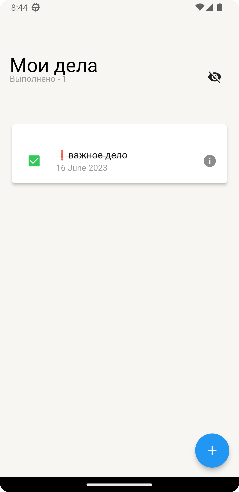
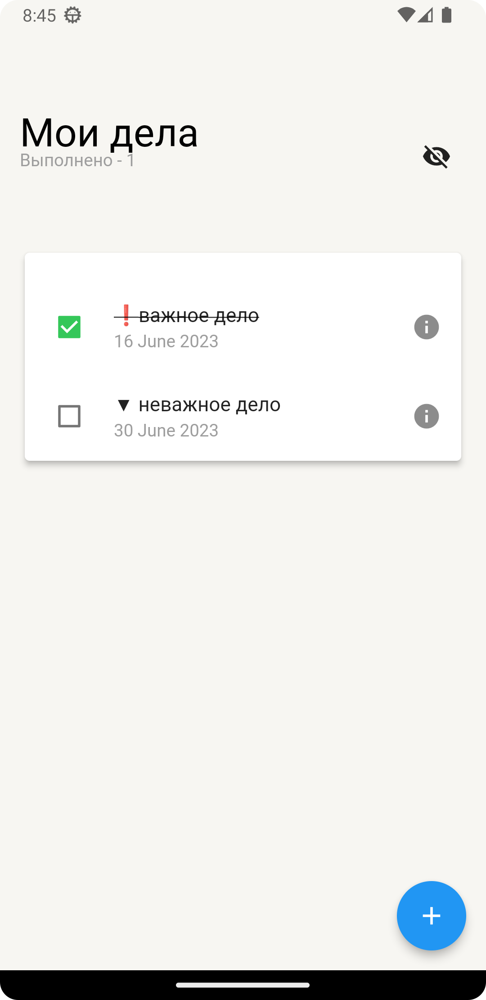

# Ada Lovelace первое домашнее задание

## Чистота кода и общая структура проекта (max 4 балла)
- [x] Есть up-to-date README со ссылкой на загрузку .apk, перечнем реализованных фич, пара скриншотов (+1 балл)
- [x] Форматирование кода присутствует (+1 балл)
- [ ] Код разбит на фичи и слои (не важно, feature-first / layer-first) (+2 балла)
## Вёрстка + навигация (max 16 баллов)
- [x] Полностью свёрстаны 2 экрана по макетам: основной и добавления/редактирования задачи (+10 баллов). Анимации не ожидаем.
  - Инконки приоритетной/не приоритетной задачи отличаются от макета
  - Поведение SliverAppBar в различных состояниях отличается от макета
  - ...
- [x] Свайп по айтему Выполнено/Удалить с логикой (+3 балла)
- [x] Показ выполненных дел с логикой (+3 балла)
## Разное (max 6 баллов)
- [ ] Реализовано нормальное логирование (не print'ы) (+2 балла)
- [x] Есть человеческая иконка у приложения (iOS или Android) (+4 балла)

